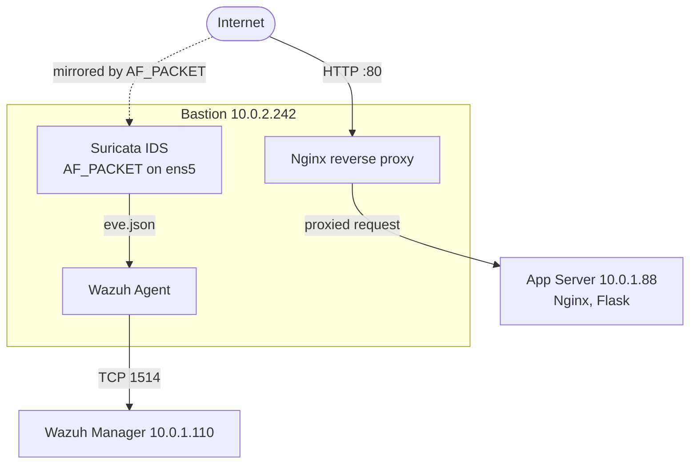
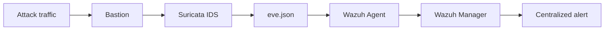

# Suricata Network IDS

| | |
|---|---|
| **Component** | Suricata 8.0.3 network intrusion detection system (NIDS) |
| **Host** | OxCart Bastion (`10.0.2.242`), capture interface `ens5` |
| **Mode** | IDS (detect and alert, no blocking) |
| **Rulesets** | Emerging Threats Open (53,000+ signatures) plus custom OxCart rules |
| **Integration** | `eve.json` > Wazuh Agent > Wazuh Manager (`10.0.1.110`) |
| **Status** | Operational |
| **Part of** | Phase 6 of the [OxCart roadmap](../README.md#12-roadmap) |

---

## 1. Objective

Deploy Suricata as a network intrusion detection system inside the OxCart AWS environment and integrate its alerts with Wazuh. The IDS was designed to:

- Monitor HTTP traffic reaching the OxCart environment.
- Detect common web attack patterns.
- Use both community-maintained Emerging Threats rules and custom OxCart rules.
- Forward events to Wazuh for centralized monitoring and analysis.
- Test detection accuracy with both malicious and legitimate requests.
- Evaluate the rules without enabling active traffic blocking.

---

## 2. Architecture

Suricata runs on the **Bastion** rather than on a separate EC2 instance. The Bastion is already the public entry point and carries the following services:

- Nginx reverse proxy
- NAT for the private subnet
- Suricata IDS
- Wazuh agent



Suricata inspects traffic on `ens5`. The Wazuh agent monitors `/var/log/suricata/eve.json` and forwards the JSON events to the Wazuh manager.

### Why the Bastion?

| Benefit | Explanation |
|---|---|
| **Single choke point** | All inbound web traffic crosses the Bastion, so one sensor covers the public surface. |
| **Real client IP** | At the Bastion, Suricata sees the original client address. Flask logs on the App Server only see the Bastion as the source, so Suricata also closes the [source-attribution gap](../README.md#11-known-limitations). |
| **Both legs visible** | `ens5` carries the client-to-Bastion request and the Bastion-to-App request, so each proxied request can be seen from both sides. |
| **No extra cost** | No additional EC2 instance is required. |

The trade-off is that the Bastion now hosts more services, which affects sizing and resilience (see [Limitations](#10-limitations)).

---

## 3. Installation and Configuration

Suricata 8.0.3 was installed from the Suricata stable repository and verified:

```bash
suricata --build-info
```

The build confirmed AF_PACKET packet capture support. The Bastion's capture interface was identified with:

```bash
ip -br addr
```

```text
ens5    10.0.2.242/24
```

AF_PACKET was configured to monitor `ens5` (illustrative `suricata.yaml` excerpt):

```yaml
af-packet:
  - interface: ens5
```

The configuration was validated before every restart:

```bash
sudo suricata -T -c /etc/suricata/suricata.yaml
```

---

## 4. Rules

### 4.1 Emerging Threats Open

Rules were pulled with `suricata-update`:

```bash
sudo suricata-update
```

The update loaded more than 53,000 signatures. Using a maintained ruleset avoids writing custom rules for every attack type.

### 4.2 Custom SQL Injection Rule

The Emerging Threats rules did not reliably detect the SQL injection payload used in the OxCart testing, so a custom rule was added in `/var/lib/suricata/rules/oxcart.rules` and loaded through `suricata.yaml`:

```text
alert http any any -> any any (msg:"OxCart SQL Injection test"; flow:established,to_server; http.uri.raw; content:"%27%20OR%20%27"; nocase; sid:1000001; rev:5;)
```

| Element | Purpose |
|---|---|
| `alert http any any -> any any` | Inspect HTTP traffic in any direction |
| `flow:established,to_server` | Only requests on established connections, travelling to the server |
| `http.uri.raw` | Match against the raw (still URL-encoded) request URI |
| `content:"%27%20OR%20%27"` | Encoded form of `' OR '` |
| `nocase` | Case-insensitive match |
| `sid:1000001` | Local signature ID |

---

## 5. Detection Tests

Each attack below was sent from the Windows workstation to the Bastion's public address and checked in Suricata's `eve.json`, then in Wazuh.

### 5.1 SQL Injection (custom rule)

```powershell
curl.exe "http://<BASTION_PUBLIC_IP>/product?id=1%27%20OR%20%271%27%3D%271"
```

Decoded: `/product?id=1' OR '1'='1`

Suricata raised `OxCart SQL Injection test` (SID `1000001`) and the alert was forwarded to Wazuh as rule `86601`: *Suricata: Alert - OxCart SQL Injection test*.

Alerts were watched live on the Bastion with:

```bash
sudo tail -f /var/log/suricata/eve.json | jq -c \
  'select(.event_type == "alert") | {timestamp, src_ip, dest_ip, proto, alert: .alert.signature, sid: .alert.signature_id}'
```


The screenshot shows two things:

- **The SQL injection alert fires twice for one request.** The first alert is the proxied leg (`10.0.2.242` to `10.0.1.88`); the second is the inbound leg from the external client. Because Suricata sees both legs, only the inbound alert carries the true client address (redacted in the screenshot).
- **Real Internet traffic arrived within minutes.** The later alerts (`ET CINS Active Threat Intelligence Poor Reputation IP`, `ET DROP Dshield Block Listed Source`, `SURICATA HTTP Request excessive header repetition`) come from external sources that match public threat-intelligence lists, not from the lab's own testing. A public-facing host is scanned almost immediately.

### 5.2 Cross-Site Scripting (Emerging Threats)

A reflected-XSS-style request tested whether existing rules recognised the pattern:

```powershell
curl.exe "http://<BASTION_PUBLIC_IP>/product?search=%3Cscript%3Ealert(1)%3C%2Fscript%3E"
```

Suricata matched the existing Emerging Threats signature, so no custom rule was required:

| Field | Value |
|---|---|
| Signature | `ET WEB_SERVER Script tag in URI Possible Cross Site Scripting Attempt` |
| SID / rev | `2009714` / `9` |
| Category | Web Application Attack |
| Tags | `Cross_Site_Scripting`, `XSS` |
| Confidence | Medium |
| Action | `allowed` (IDS mode) |

Wazuh generated *Suricata: Alert - ET WEB_SERVER Script tag in URI Possible Cross Site Scripting Attempt*. The screenshot below is from the Wazuh manager's `alerts.json`:


### 5.3 Command Injection and Sensitive File Access (Emerging Threats)

```powershell
curl.exe "http://<BASTION_PUBLIC_IP>/product?id=1%3Bcat%20%2Fetc%2Fpasswd"
```

Decoded: `/product?id=1;cat /etc/passwd`

| Field | Value |
|---|---|
| Signature | `ET WEB_SERVER /etc/passwd Detected in URI` |
| SID / rev | `2049400` / `1` |
| Category | Attempted Information Leak |
| Confidence | High |
| Action | `allowed` (IDS mode) |

Again no custom rule was needed. Wazuh generated *Suricata: Alert - ET WEB_SERVER /etc/passwd Detected in URI*:


### 5.4 Detection Happens Regardless of Application Outcome

In both Wazuh screenshots the HTTP status for the malicious request is `404`. The application never processed the payloads, but Suricata still alerted on the traffic. Network-layer detection does not depend on the application succeeding, failing, or logging the request, which makes it a useful complement to host-level and application-level logs.

---

## 6. Suricata to Wazuh Integration

The Wazuh agent on the Bastion reads Suricata's JSON log:

```xml
<localfile>
    <log_format>json</log_format>
    <location>/var/log/suricata/eve.json</location>
</localfile>
```

In Wazuh, these events arrive under agent `ip-10-0-2-242` (the Bastion), decoded by the `json` decoder, and are grouped as `ids, suricata` (rule `86601`).

### Decoder Field Limit

Some Suricata events contain more fields than Wazuh's default JSON decoder allows, and the manager logged:

```text
Too many fields for JSON decoder
```

The limit was raised in `/var/ossec/etc/internal_options.conf`:

```text
analysisd.decoder_order_size=256   # before
analysisd.decoder_order_size=512   # after
```

After restarting the Wazuh manager, the events were decoded and stored as alerts. This confirmed that Wazuh was parsing the Suricata JSON, not just collecting the file.

---

## 7. False-Positive Testing

After the attack signatures worked, legitimate requests that resemble attacks were sent to check that the rules were not overly broad.

| Test | Request (decoded) | Alert? | What it shows |
|---|---|---|---|
| SQL-like syntax without the malicious pattern | `/product?id=1 OR 2` | No | The custom rule does not match generic SQL words |
| Benign use of the word `javascript` | `/product?description=javascript tutorial` | No | The XSS signature is not triggered by the word alone |
| Legitimate filesystem path | `/product?path=/var/www/html` | No | The signature targets `/etc/passwd`, not arbitrary paths |

---

## 8. Detection Results

| Attack type | Detection source | Suricata alert | In Wazuh |
|---|---|---|---|
| SQL injection | Custom OxCart rule | `OxCart SQL Injection test` | Yes |
| Cross-site scripting | Emerging Threats | `ET WEB_SERVER Script tag in URI Possible Cross Site Scripting Attempt` | Yes |
| Command injection / sensitive file access | Emerging Threats | `ET WEB_SERVER /etc/passwd Detected in URI` | Yes |

Legitimate requests resembling these patterns produced no alerts.

The end-to-end pipeline:



---

## 9. IDS Rather Than IPS

Suricata was deliberately deployed in IDS mode. It detects and records suspicious traffic but does not drop packets. Alerts carry `"action": "allowed"` for this reason.

Running detection-only first allows the team to:

1. Observe normal traffic.
2. Test attack signatures.
3. Measure detection accuracy.
4. Identify false positives.
5. Tune rules before introducing prevention.

An incorrectly tuned blocking rule could disrupt legitimate OxCart traffic, so this is the safer route toward IPS.

---

## 10. Limitations

| Limitation | Detail |
|---|---|
| **Detection only** | A detected request is logged and forwarded, but the traffic is still allowed through. |
| **Signature-based** | Effective against known patterns; may miss novel techniques, heavily obfuscated payloads, variants that match no signature, and abuse with no network signature. Application-level controls and Wazuh host monitoring remain necessary. |
| **Narrow custom SQLi rule** | The rule matches the encoded `' OR '` pattern only. A payload such as `1' OR 1=1--` encodes as `%27%20OR%201...` and would not match it. Patterns should be generalised (for example with PCRE) and extended to `UNION`, comment sequences, and encoding variants. |
| **Low Wazuh priority** | All Suricata events surface in Wazuh as rule `86601` at level 3, regardless of Suricata's own severity. Child rules should raise the level for high-value signatures such as SQLi and `/etc/passwd`. |
| **Plaintext HTTP dependency** | Inspection works because OxCart currently serves HTTP. Once TLS is added at the Bastion's Nginx, a sensor on `ens5` will see ciphertext on the external leg and URI-based rules will stop matching. Inspection would need to move to the decrypted internal leg or to the proxy's own logs. |
| **Shared host** | Suricata shares the Bastion with Nginx, NAT, and the Wazuh agent. The Bastion was first a `t3.micro`, but loading the full ruleset exhausted memory and the Linux OOM killer terminated Suricata, so it was resized to `t3.small`. The Bastion is also a single point of failure for ingress, NAT, and now detection. |

---

## 11. Outcome and Next Steps

The Suricata deployment demonstrates:

- Suricata running on an AWS EC2 instance with AF_PACKET packet inspection.
- Emerging Threats Open integrated, plus a custom SQL injection signature.
- XSS and sensitive-file-access detection using existing maintained signatures.
- Suricata JSON events forwarded to Wazuh, including resolution of the decoder field limit.
- False-positive testing against legitimate traffic.
- Resource troubleshooting and instance sizing.
- A controlled path from IDS toward potential IPS.

OxCart now has application-level controls, host-level monitoring, and network-level detection feeding a single SIEM.

**Next steps**

- Generalise the custom SQL injection signature.
- Add Wazuh child rules that raise severity for web-attack Suricata alerts.
- Evaluate suppressing or thresholding noisy reputation and protocol-anomaly alerts.
- Plan TLS inspection before HTTPS is introduced.
- Evaluate selective IPS blocking once false-positive rates are understood.

---

*Tested in a self-owned lab environment for educational and portfolio purposes. Public IP addresses have been redacted from the screenshots.*
