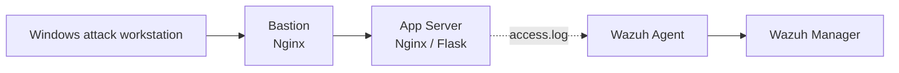
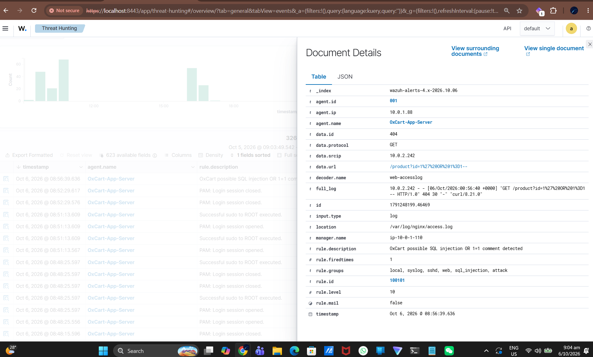
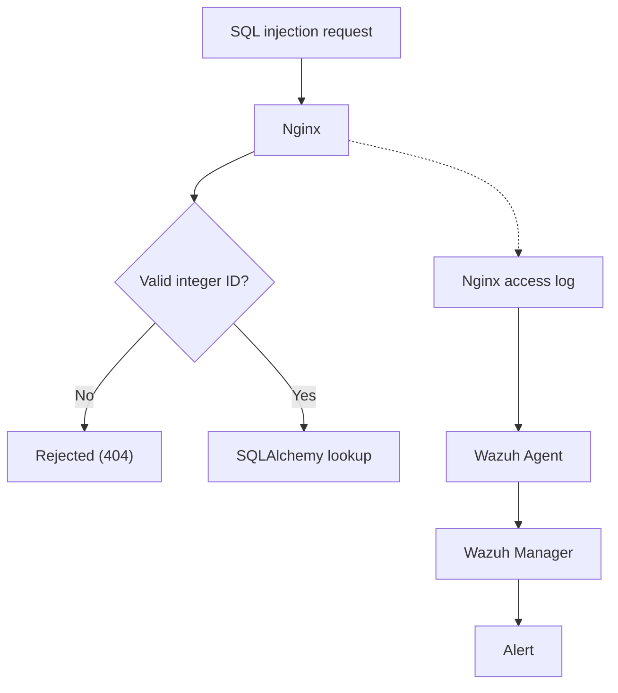

# SQL Injection: Detection and Hardening

| | |
|---|---|
| **Vulnerability** | SQL injection ([CWE-89](https://cwe.mitre.org/data/definitions/89.html)) |
| **Category** | Injection |
| **Affected endpoint** | `GET /product?id=<product_id>` |
| **Severity** | Not rated (payloads reached the endpoint; data extraction was not demonstrated) |
| **Detection** | Wazuh SIEM: custom rules `100100`, `100101`; built-in rule `31103` |
| **Status** | Hardened; formal retest pending |
| **Part of** | [OxCart Web Vulnerability Assessment](OxCart-Web-Vulnerability-Assessment.md), finding OXC-001 |

---

## 1. Objective

Determine whether the OxCart product endpoint could be attacked with SQL injection, and whether the lab's security monitoring could detect those attempts.

## 2. Background

The `/product` endpoint takes a product ID from the `id` query parameter and returns that product. A normal request looks like this:

```text
/product?id=1
```

If user input is placed directly into a SQL statement, an attacker can supply SQL syntax instead of a number and change the meaning of the query:

```text
/product?id=1' OR 1=1--
```

Sent over HTTP, the payload is URL-encoded. `%27` is a single quote and `%20` is a space:

```text
/product?id=1%27%20OR%201%3D1--
```

## 3. Attack

The request was sent from the Windows attack workstation through the Bastion, so it followed the same path as an external client:

```powershell
curl.exe "http://<BASTION_PUBLIC_IP>/product?id=1%27%20OR%201%3D1--"
```



**Result.** The application did not return a product. Nginx logged an HTTP `404`, and the full malicious URL was recorded in the access log:

```text
10.0.2.242 - - [06/Oct/2026:00:56:40 +0000] "GET /product?id=1%27%20OR%201%3D1-- HTTP/1.0" 404 30 "-" "curl/8.21.0"
```

No data extraction or modification was demonstrated, so this is recorded as an attack surface rather than a confirmed exploit. The request was still useful because it exercised the monitoring pipeline end to end.

## 4. Detection

### 4.1 Baseline

Wazuh's built-in web-server rule `31101` flagged the request as a generic HTTP error. That confirmed the log pipeline worked, but the alert did not say the request was SQL injection.

### 4.2 Custom Rule

A custom rule was added as a child of `31101`. It looks for the encoded `OR 1=1--` pattern in the requested URL:

```xml
<rule id="100101" level="10">
    <if_sid>31101</if_sid>
    <url>%27%20OR%201%3D1--</url>
    <description>OxCart possible SQL injection OR 1=1 comment detected</description>
    <group>web,sql_injection,attack,</group>
</rule>
```

The rule was developed with this workflow:

1. Capture the raw Nginx log line for the attack.
2. Draft the rule and test it offline with `sudo /var/ossec/bin/wazuh-logtest`.
3. Restart the Wazuh manager.
4. Replay the attack against the live application and confirm the alert fires.

### 4.3 Live Alert

After deployment, the same request produced the custom alert in **Wazuh Dashboard > Threat Hunting > Events**:



| Field | Value |
|---|---|
| `rule.id` | `100101` |
| `rule.level` | `10` |
| `rule.description` | OxCart possible SQL injection OR 1=1 comment detected |
| `rule.groups` | `local, syslog, sshd, web, sql_injection, attack` |
| `data.url` | `/product?id=1%27%20OR%201%3D1--` |
| `data.id` (HTTP status) | `404` |
| `location` | `/var/log/nginx/access.log` |
| `agent.name` | `OxCart-App-Server` |

> **Attribution gap:** `data.srcip` shows `10.0.2.242`, which is the Bastion, not the attacking workstation. The real client address is not yet extracted from `X-Forwarded-For`. This is a known limitation in the [architecture documentation](../README.md#11-known-limitations) and should be fixed so alerts identify the true source.

### 4.4 Other Payloads Tested

| Payload | Technique | Detection |
|---|---|---|
| `1' OR '1'='1` | Boolean-based | Custom rule `100100` |
| `1' AND '1'='1` | Boolean-based | Detected by custom SQL injection rule |
| `1' UNION SELECT 1,2,3--` | UNION-based | Built-in rule `31103` |
| `1' OR 1=1--` | Boolean with comment | Generic `31101` first; custom rule `100101` after tuning |

The `OR 1=1--` payload only produced the generic alert until rule `100101` was added, which showed that one signature does not cover every variant.

## 5. Root Cause and Remediation

The underlying concern is trusting user-controlled input at the application boundary. A product ID is an integer identifier and should never be treated as SQL.

The product lookup was reviewed and hardened to do two things:

1. **Parse the parameter as an integer.** A value such as `1' OR 1=1--` is not a valid integer and is never treated as a product ID.
2. **Look the product up through SQLAlchemy** rather than building a SQL string from the URL parameter.

```python
product_id = request.args.get("id", type=int)

product = Product.query.get(product_id)

if product is None:
    return {"error": "Product not found"}, 404
```

Invalid or unknown identifiers resolve to no product and return a clean `404` instead of being processed as a database request.

## 6. Defence in Depth

Secure code is the primary control. Wazuh detection is an additional layer and not a replacement for it.



Even if an attacker sends a payload, the application should stop it from becoming executable SQL, while the monitoring layer still records and alerts on the attempt.

## 7. Results

- The `/product` endpoint accepted attacker-controlled query parameters, and SQL injection payloads reached it over HTTP.
- Nginx recorded the malicious requests and Wazuh received the logs.
- Built-in and custom Wazuh rules detected the tested patterns.
- The endpoint was hardened to parse the ID as an integer and query through SQLAlchemy.

## 8. Remaining Work

- **Formal retest.** Replay the payloads in section 4.4 against the hardened endpoint and record that each returns a clean error with no data leakage.
- **Generalise detection.** The custom rules match specific encoded strings and depend on the `31101` error parent, so variants with different casing, whitespace, or encoding could evade them.
- **Fix source attribution** so alerts show the real client IP.

---

*Tested in a self-owned lab environment for educational and portfolio purposes.*
