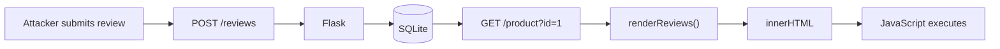
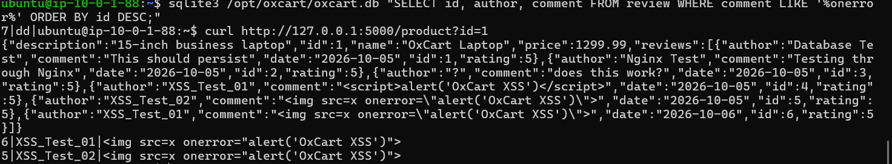
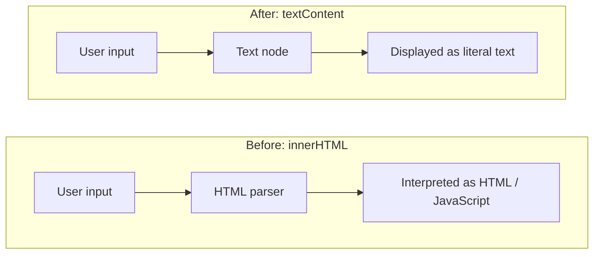
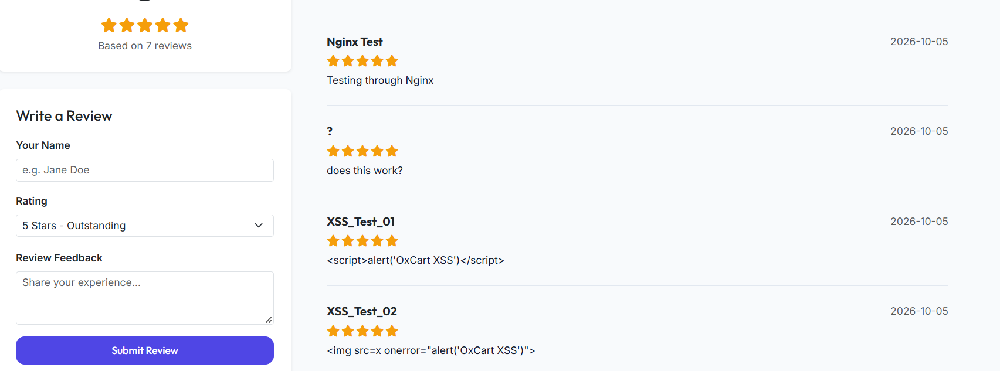
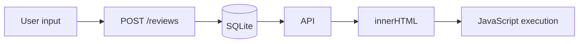
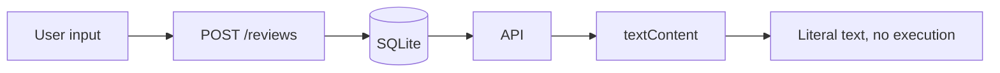

# Stored Cross-Site Scripting (XSS): Discovery and Remediation

| | |
|---|---|
| **Vulnerability** | Stored cross-site scripting ([CWE-79](https://cwe.mitre.org/data/definitions/79.html)) |
| **Category** | Injection / client-side security |
| **Affected feature** | Product reviews (`author`, `comment`) |
| **Severity** | Medium, CVSS 3.1 estimate 6.1 (`AV:N/AC:L/PR:N/UI:R/S:C/C:L/I:L/A:N`) |
| **Status** | Remediated and retested |
| **Part of** | [OxCart Web Vulnerability Assessment](OxCart-Web-Vulnerability-Assessment.md), finding OXC-002 |

> The CVSS vector assumes reviews can be posted without authentication. If posting requires an account, the score is lower.

---

## 1. Objective

Determine whether an attacker could submit JavaScript through the product review form and have it execute when other users view the review, and whether the malicious content stays stored after a page refresh.

## 2. Vulnerability

OxCart lets users submit a review with an author name and comment. Reviews are stored in the SQLite database and returned to the frontend through the `/product` endpoint.

The original `renderReviews()` function built the review HTML with a JavaScript template string:

```javascript
feedHtml += `
  <article class="review-card">
    ...
    <h4>${r.author}</h4>
    ...
    <p>${r.comment}</p>
  </article>
`;
```

The string was then inserted into the page with:

```javascript
feedContainer.innerHTML = feedHtml;
```

`r.author` and `r.comment` come from user-submitted data. Because they were placed into `innerHTML`, the browser parsed attacker-controlled content as HTML instead of displaying it as text.

## 3. Exploitation

### 3.1 First Payload

```html
<script>alert('OxCart XSS')</script>
```

The payload was stored, but it did not execute. Browsers do not run `<script>` elements that are inserted through `innerHTML`. This did not make the application safe. It only showed that this payload does not work in this rendering context.

### 3.2 Working Payload

An event-handler payload is not subject to that restriction:

```html

```

When the browser tried to load the invalid image source, the `onerror` handler ran and produced an `OxCart XSS` alert, confirming JavaScript execution.

### 3.3 Attack Path



## 4. Persistence

The payload was not only held in browser memory. It was stored in SQLite and returned by the API, which confirms the issue is **stored** XSS rather than reflected.

The screenshot below shows both checks on the App Server. The `sqlite3` query (bottom) finds the stored `onerror` payloads, and a `curl` request to `/product?id=1` (top) shows the API returning the same payloads inside the `reviews` array.



Stored rows, as returned by the database:

```text
6|XSS_Test_01|
5|XSS_Test_02|
```

Storing user input is normal. The vulnerability appeared when that stored input was later treated as trusted HTML.

## 5. Root Cause

The root cause was rendering untrusted review data with `innerHTML`. In effect, the code did this:

```javascript
element.innerHTML = userControlledData;
```

That tells the browser to parse the value as HTML, so a string like `` becomes a real image element instead of visible text.

## 6. Remediation

The review renderer was rewritten to build elements with the DOM API. Untrusted fields are assigned with `textContent`, so the browser treats them as text only:

```javascript
const author = document.createElement("h4");
author.className = "h6 mb-0 fw-bold text-dark";
author.textContent = r.author;

const comment = document.createElement("p");
comment.className = "mb-0 small text-slate-700";
comment.textContent = r.comment;
```

The elements are then assembled and added to the page:

```javascript
header.appendChild(author);
header.appendChild(date);

reviewCard.appendChild(header);
reviewCard.appendChild(stars);
reviewCard.appendChild(comment);

feedContainer.appendChild(reviewCard);
```

This changes how the browser handles the data:



### Why `textContent`

Author names and comments do not need HTML formatting. Allowing HTML would add attack surface for no benefit, so the rule applied is: **review content is data, not markup.**

The existing `innerHTML` use for the star rating was kept, because that markup is generated by the application's own `getStarsHtml()` function and not supplied directly by the user.

## 7. Retest

After the fix, the existing malicious reviews were reloaded and the payload was submitted again. Both payloads now appear as plain text and no JavaScript alert is triggered:



Both `XSS_Test_01` (the `<script>` payload) and `XSS_Test_02` (the `` payload) are shown as comment text. The stored database values were not changed. The fix works at output time, so existing malicious rows are neutralised without deleting any data.

## 8. Result

Before remediation:



After remediation:



The vulnerability was reproduced, documented, remediated, and retested.

## 9. Further Hardening

The `textContent` fix addresses the root cause. These steps add defence in depth:

- **Validate input server-side.** Enforce length limits on `author` and `comment`, and require `rating` to be an integer from 1 to 5. This matters because star markup is built from the rating value and still goes through `innerHTML`.
- **Add a Content Security Policy** without `'unsafe-inline'`, which would also have blocked the `onerror` handler.
- **Set `HttpOnly`, `Secure`, and `SameSite` on session cookies** to limit what injected script could reach.
- **Improve detection.** The current logs do not record `POST` bodies, so a malicious review submission looks like an ordinary `POST /reviews`. Logging request bodies or validation failures would give Wazuh something to alert on.

> **Principle:** data supplied by users must not be treated as executable HTML or JavaScript.

---

*Tested in a self-owned lab environment for educational and portfolio purposes. The proof of concept used a harmless `alert()`, and no credentials, session tokens, or personal data were accessed.*
