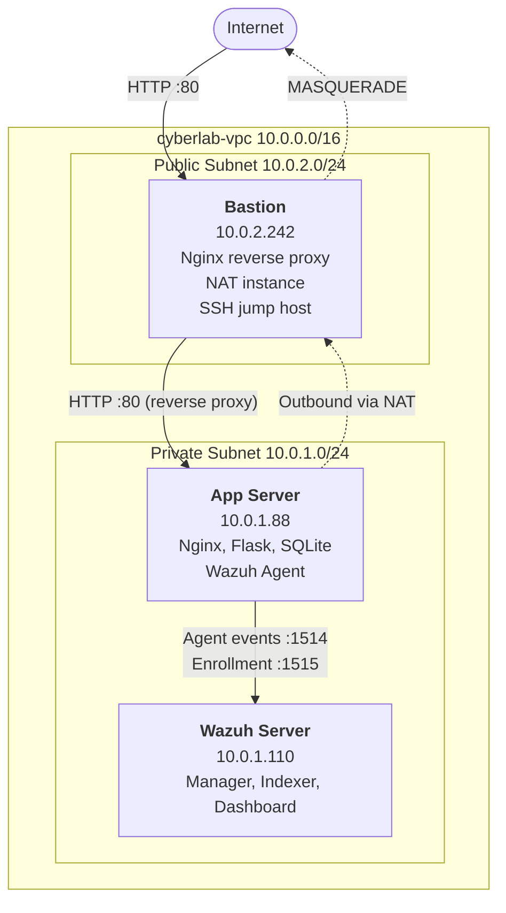
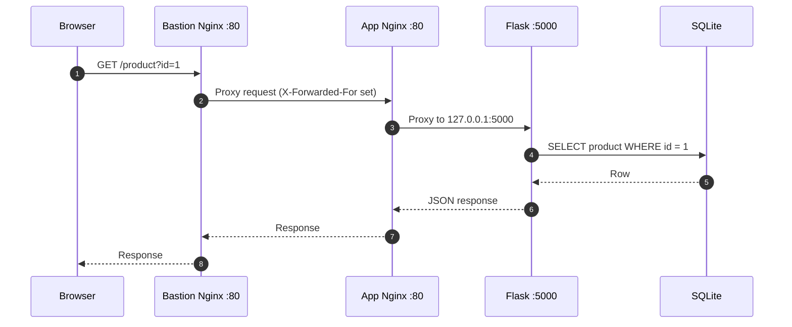
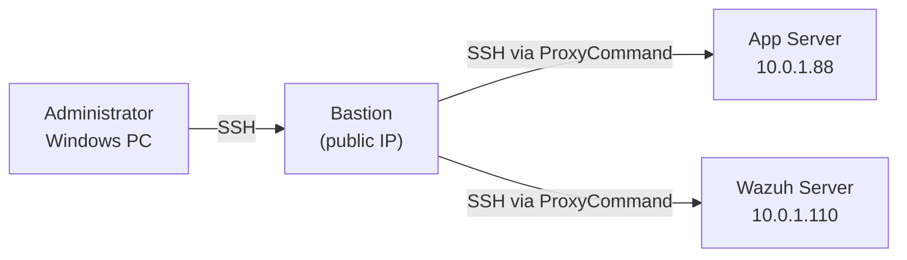
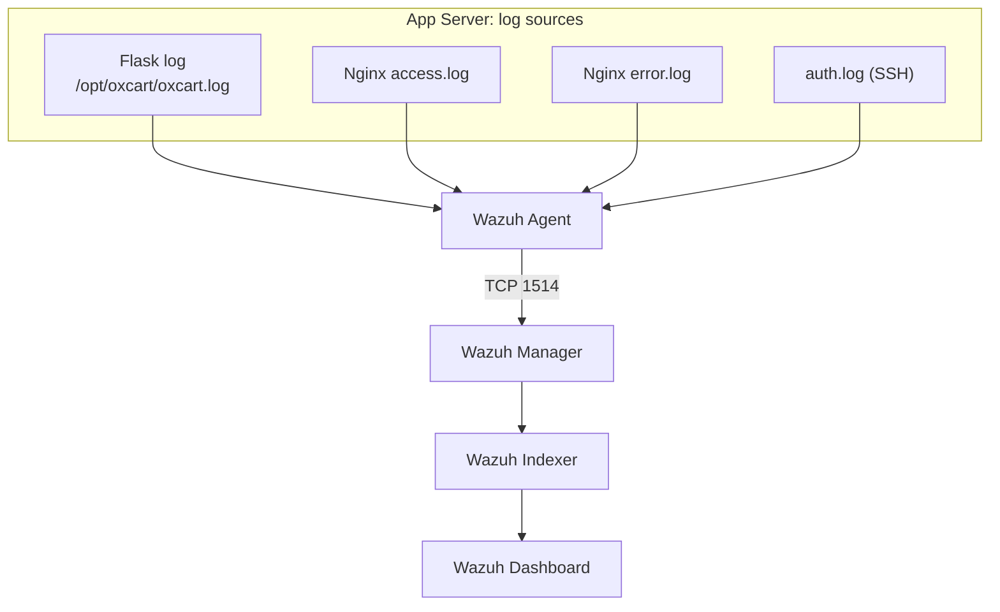
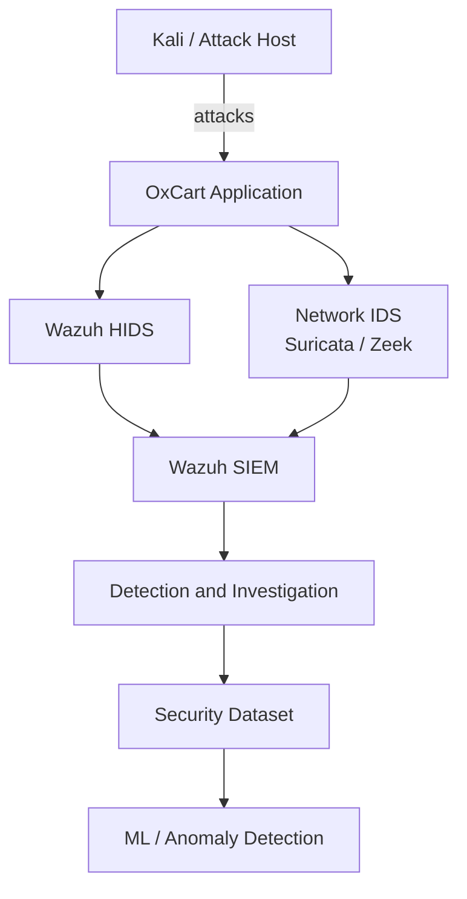

# OxCart: Cloud Cybersecurity Lab

> A segmented AWS environment hosting a production-style web application, with centralized host and application telemetry collected by a private Wazuh SIEM. Built as a foundation for detection engineering, attack simulation, and network anomaly detection.


---

## Table of Contents

1. [Overview](#1-overview)
2. [Architecture](#2-architecture)
3. [Network Design](#3-network-design)
4. [Bastion Host](#4-bastion-host)
5. [Application Layer](#5-application-layer)
6. [Security Monitoring (Wazuh SIEM)](#6-security-monitoring-wazuh-siem)
7. [Access Model](#7-access-model)
8. [Security Controls](#8-security-controls)
9. [Telemetry Pipeline and Verification](#9-telemetry-pipeline-and-verification)
10. [Design Decisions and Trade-offs](#10-design-decisions-and-trade-offs)
11. [Known Limitations](#11-known-limitations)
12. [Roadmap](#12-roadmap)
13. [Tech Stack](#13-tech-stack)

---

## 1. Overview

OxCart is a deliberately constructed cloud environment that simulates a small production-style web application while providing the infrastructure needed for security monitoring, detection engineering, incident response, and attack simulation.

The web application is not the end goal. It is the **workload** that generates realistic network, application, and host activity. The surrounding architecture is the actual project:

- Network segmentation across public and private subnets
- Bastion-based administration and controlled ingress
- Private application hosting and layered reverse proxying
- Cost-efficient NAT for outbound connectivity
- Host-based monitoring and centralized logging
- A private SIEM for event collection and investigation

**Long-term goal:** evolve the environment into a miniature SOC-style laboratory, ending in ML-based network anomaly detection.

### Current Status

| Component | Status |
|---|---|
| VPC, subnets, routing, Internet Gateway | Operational |
| Bastion (jump host, reverse proxy, NAT) | Operational |
| App Server (Nginx, Flask, SQLite) | Operational |
| Wazuh Manager, Indexer, Dashboard | Operational |
| Wazuh Agent on App Server | Operational |
| End-to-end log collection | **Verified** |

---

## 2. Architecture

The core design principle: **the application server and the SIEM are never directly exposed to the Internet.** The Bastion is the single, controlled boundary between the Internet and the private infrastructure.



### Request Flow



---

## 3. Network Design

### VPC

| Property | Value |
|---|---|
| Name | `cyberlab-vpc` |
| CIDR | `10.0.0.0/16` |
| Region | `ap-southeast-1` (Singapore) |

The /16 leaves headroom for planned additions: IDS sensors, an attacker host, a dedicated database tier, and further application servers.

### Subnets

| Subnet | CIDR | Purpose | Hosts |
|---|---|---|---|
| `cyberlab-public` | `10.0.2.0/24` | Controlled Internet-facing infrastructure | Bastion (`10.0.2.242`) |
| `cyberlab-private` | `10.0.1.0/24` | Protected workloads, no direct Internet exposure | App Server (`10.0.1.88`), Wazuh (`10.0.1.110`) |

### Routing

**`cyberlab-public-rt`**

| Destination | Target |
|---|---|
| `10.0.0.0/16` | local |
| `0.0.0.0/0` | `cyberlab-igw` (Internet Gateway) |

**`cyberlab-private-rt`**

| Destination | Target |
|---|---|
| `10.0.0.0/16` | local |
| `0.0.0.0/0` | Bastion instance (NAT) |

The private subnet has no route to the Internet Gateway. Its outbound traffic is forced through the Bastion.

---

## 4. Bastion Host

The Bastion is the most important component in the design. It performs four roles.

| Role | Description |
|---|---|
| **Administrative jump host** | Private servers have no public IPs. All SSH administration passes through the Bastion. |
| **Reverse proxy** | Receives public HTTP on port 80 and forwards to the private App Server. |
| **NAT instance** | Provides outbound Internet access to the private subnet for package installation and updates. |
| **Security boundary** | The only component that accepts public web traffic. |

### NAT Configuration

IP forwarding is enabled and persisted:

```conf
# /etc/sysctl.d/99-oxcart-nat.conf
net.ipv4.ip_forward=1
```

The EC2 **source/destination check is disabled** on the Bastion, since it forwards traffic not addressed to itself. Private-subnet sources are masqueraded on egress:

```bash
sudo iptables -t nat -A POSTROUTING \
  -s 10.0.1.0/24 \
  -o ens5 \
  -j MASQUERADE
```

The rule is persisted with `iptables-persistent`, and the configuration has been **reboot-tested**.

### Reverse Proxy Configuration

```nginx
server {
    listen 80;
    server_name _;

    location / {
        proxy_pass http://10.0.1.88:80;

        proxy_set_header Host              $host;
        proxy_set_header X-Real-IP         $remote_addr;
        proxy_set_header X-Forwarded-For   $proxy_add_x_forwarded_for;
        proxy_set_header X-Forwarded-Proto $scheme;
    }
}
```

A request to `http://<bastion-public-ip>/products` is transparently served from `http://10.0.1.88/products`.

> **Note:** The Bastion's public IPv4 address is assigned by AWS and may change after a stop/start cycle. An Elastic IP would make it persistent.

---

## 5. Application Layer

### Stack

```
Browser -> Bastion Nginx -> App Nginx -> Flask (127.0.0.1:5000) -> SQLite
```

| Component | Details |
|---|---|
| **OS** | Ubuntu |
| **Web server** | Nginx: HTTP serving, reverse proxying, static files, access/error logging |
| **Backend** | Python / Flask, bound to `127.0.0.1:5000` only |
| **Database** | SQLite at `/opt/oxcart/oxcart.db` |
| **Process management** | `systemd` unit (`oxcart.service`): auto-start on boot, restart on failure |
| **App directory** | `/opt/oxcart` (virtualenv at `/opt/oxcart/venv`) |

Flask listens only on the loopback interface, so it is unreachable from the network. Only the local Nginx can talk to it.

### Endpoints

| Endpoint | Purpose |
|---|---|
| `/` | Storefront |
| `/health` | Health check |
| `/products` | Product list (JSON) |
| `/product?id=<id>` | Single product (JSON) |

### Frontend

The frontend is based on the open-source [CommerceFlow](https://github.com/lakshhchopra/E-Commerce-Website) project (HTML, CSS, Bootstrap, JavaScript). The original used a client-side mock product database. OxCart replaces this with real calls to the Flask API:

```
Browser -> GET /products -> Bastion -> App Nginx -> Flask -> SQLite -> JSON -> storefront
```

This gives the project a genuine backend/API layer that produces realistic HTTP traffic, rather than serving a static site.

### Application Logging

Flask logs each request in a structured key=value format designed for SIEM parsing:

```
request method=GET path=/products query= src_ip=10.0.2.242 status=200 duration=0.001
```

| Field | Detection use |
|---|---|
| method, path, query | Injection and traversal patterns, endpoint enumeration |
| src_ip | Attribution and rate analysis |
| status | Repeated 404s, error spikes |
| duration | Abnormal request behavior |

---

## 6. Security Monitoring (Wazuh SIEM)

### Deployment

| Property | Value |
|---|---|
| Host | Dedicated EC2 instance, `10.0.1.110` |
| OS | Ubuntu |
| Instance type | `c7i-flex.large` (2 vCPU, 4 GiB RAM) |
| Storage | 40 GiB gp3 (expanded from 20 GiB, which proved insufficient during installation) |
| Version | Wazuh 4.14 (agent `4.14.7-1`) |

### Components

| Component | Role |
|---|---|
| **Wazuh Manager** | Receives agent data and applies detection logic |
| **Wazuh Indexer** | Stores and indexes events for search and investigation |
| **Wazuh Dashboard** | Web UI for alerts, agent status, threat hunting, and dashboards (HTTPS :443, internal only) |

### Why a Separate Server?

Isolating the SIEM from the workload it monitors means a compromised App Server does not automatically imply a compromised SIEM. It also provides independent storage, centralized alert processing, and a simple onboarding path for future hosts: install an agent and point it at the manager.

### Log Sources (App Server Agent)

| Log | Layer | Contents |
|---|---|---|
| `/opt/oxcart/oxcart.log` | Application | Flask request telemetry |
| `/var/log/nginx/access.log` | Web server | HTTP requests |
| `/var/log/nginx/error.log` | Web server | Errors and upstream failures |
| `/var/log/auth.log` | Host / authentication | SSH and system authentication events |

The agent enrolls over TCP 1515 and ships events over TCP 1514.

---

## 7. Access Model

All administration is performed through the Bastion. No private host has a public IP.



**Bastion access**

```bash
ssh -i ".\Bastionhost-keypair.pem" ubuntu@<BASTION_PUBLIC_IP>
```

**Private hosts** are reached with an SSH `ProxyCommand` (or `-J`) that hops through the Bastion, so no public IP is required.

**Wazuh Dashboard** is never exposed publicly. It is reached through an SSH local port forward:

```bash
ssh -i ".\Bastionhost-keypair.pem" \
    -L 8443:10.0.1.110:443 \
    ubuntu@<BASTION_PUBLIC_IP>
```

Then browse to `https://localhost:8443`.

---

## 8. Security Controls

### AWS Security Groups (role-based)

| Security Group | Inbound Rule | Source |
|---|---|---|
| `OxCart-bastion-sg` | TCP 22 | Administrator's public IP only |
| | TCP 80 | Internet |
| `OxCart-app-sg` | TCP 22 | `OxCart-bastion-sg` |
| | TCP 80 | `OxCart-bastion-sg` |
| `OxCart-wazuh-sg` | TCP 22 | `OxCart-bastion-sg` |
| | TCP 1514 (agent events) | `OxCart-app-sg` |
| | TCP 1515 (agent enrollment) | `OxCart-app-sg` |

Rules reference **security groups rather than IP ranges**, so access is tied to role and remains correct if addresses change.

### Host Firewall

UFW on the App Server: default-deny inbound, default-allow outbound, with SSH and HTTP permitted only from the Bastion / private network.

### Defense in Depth

| Layer | Control |
|---|---|
| Network | VPC isolation, public/private subnet segmentation |
| Perimeter | Bastion as sole public entry point |
| Cloud firewall | Role-based Security Groups |
| Host firewall | UFW default-deny |
| Application | Flask bound to loopback, fronted by Nginx |
| Detection | Wazuh Agent on host |
| Monitoring | Centralized Wazuh SIEM in a private subnet |

### Principles Applied

Network segmentation, least exposure, private application and SIEM tiers, centralized monitoring, separation of duties, and controlled administrative access.

---

## 9. Telemetry Pipeline and Verification



### Verification

The full pipeline was tested end to end. Requests were generated against the App Server:

```
GET /health
GET /products
GET /product?id=1
GET /does-not-exist
```

Results:

1. Requests appeared in `/opt/oxcart/oxcart.log`.
2. The Wazuh Agent collected the entries.
3. Events appeared in **Wazuh Dashboard, Threat Hunting, Events**, attributed to agent `OxCart-App-Server`.
4. Agent log confirmed transport: `Connected to the server ([10.0.1.110]:1514/tcp)`.

This confirms `HTTP request -> Flask log -> Agent -> Manager -> Indexer -> Dashboard` works as designed.

<!-- Suggested: add screenshots here, e.g. docs/images/wazuh-events.png -->

---

## 10. Design Decisions and Trade-offs

| Decision | Rationale | Production alternative |
|---|---|---|
| **Bastion as NAT instance** instead of AWS NAT Gateway | NAT Gateways carry ongoing hourly and data costs; a self-managed NAT keeps the lab inexpensive. | Managed, multi-AZ NAT Gateway |
| **SQLite on the App Server** | The project focus is security, not database administration. Flask abstracts data access, so a dedicated DB server can be introduced later without changing the frontend contract. | Dedicated managed database (e.g. RDS) |
| **Two Nginx layers** | Bastion Nginx enforces the public boundary; App Nginx separates web serving from the application and adds its own logs. | Load balancer / WAF in front, single proxy tier |
| **Dedicated SIEM host** | Isolates monitoring from the monitored workload and allows centralized ingestion of future hosts. | Same, typically clustered |
| **SSH tunnel for the dashboard** | Keeps port 443 off the Internet entirely. | VPN or SSO-fronted access |
| **Reuse open-source frontend** | Effort is spent on infrastructure and security, not UI. | n/a |

---

## 11. Known Limitations

Documented openly, with planned remediation.

| Limitation | Impact | Planned fix |
|---|---|---|
| **Client IP not preserved in Flask logs.** The app currently logs the Bastion (`10.0.2.242`) as `src_ip`. `X-Forwarded-For` is sent but not yet trusted/extracted downstream. | Attacker attribution and rate-based detections are unreliable. | Configure Nginx `real_ip` (`set_real_ip_from 10.0.2.242`, `real_ip_header X-Forwarded-For`) and update Flask logging. **To be completed before attack simulation.** |
| **Bastion is a single point of failure** for ingress, NAT, and administration. | Bastion outage removes all three functions. | Acceptable for a lab; managed NAT / HA in production. |
| **HTTP only** | Traffic is unencrypted. | Add TLS. |
| **Non-persistent public IP** | Address changes after stop/start. | Elastic IP. |
| **No WAF** | No application-layer filtering in front of the app. | Evaluate WAF. |

---

## 12. Roadmap

The current environment is the **baseline**. Future work builds security capability on top of it rather than modifying the base infrastructure.

```mermaid
flowchart LR
    P1["Phase 1<br/>Infrastructure"] --> P2["Phase 2<br/>Application"]
    P2 --> P3["Phase 3<br/>Centralized Logging / SIEM"]
    P3 --> P4["Phase 4<br/>Detection Engineering"]
    P4 --> P5["Phase 5<br/>Attack Simulation"]
    P5 --> P6["Phase 6<br/>Network IDS"]
    P6 --> P7["Phase 7<br/>Incident Response"]
    P7 --> P8["Phase 8<br/>ML / Anomaly Detection"]

    classDef done fill:#1a7f37,stroke:#1a7f37,color:#fff
    classDef todo fill:#57606a,stroke:#57606a,color:#fff
    class P1,P2,P3 done
    class P4,P5,P6,P7,P8 todo
```



| Phase | Focus | Status |
|---|---|---|
| 1 | Infrastructure | Done |
| 2 | Application | Done |
| 3 | Centralized logging / SIEM | Done |
| 4 | Detection engineering (custom Wazuh rules) | Planned |
| 5 | Attack simulation (Kali attacker host) | Planned |
| 6 | Network IDS (Suricata / Zeek) | Planned |
| 7 | Incident response and automation | Planned |
| 8 | ML / anomaly detection on collected datasets | Planned |

**Candidate additions:** Kali Linux attacker VM, Suricata, Zeek, VPC Flow Logs, CloudTrail, GuardDuty, dedicated database server, HTTPS/TLS, WAF, additional Wazuh agents, custom detection rules, and attack datasets. These will be introduced incrementally.



---

## 13. Tech Stack

| Category | Technologies |
|---|---|
| **Cloud** | AWS (VPC, EC2, Security Groups, Internet Gateway, Route Tables) |
| **Networking** | iptables (NAT/MASQUERADE), IP forwarding, SSH tunneling / ProxyCommand |
| **Web** | Nginx (reverse proxy), Flask, SQLite, Bootstrap |
| **Security** | Wazuh (Manager, Indexer, Dashboard, Agent), UFW |
| **OS / Ops** | Ubuntu, systemd, Python virtualenv |

---

*OxCart is a personal cybersecurity lab and portfolio project.*
