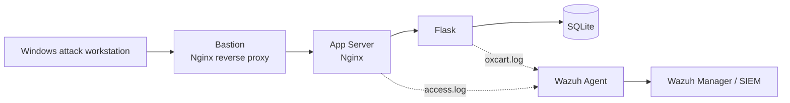
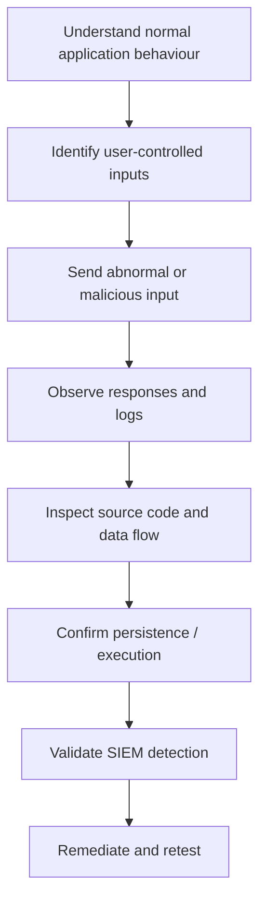
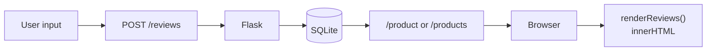
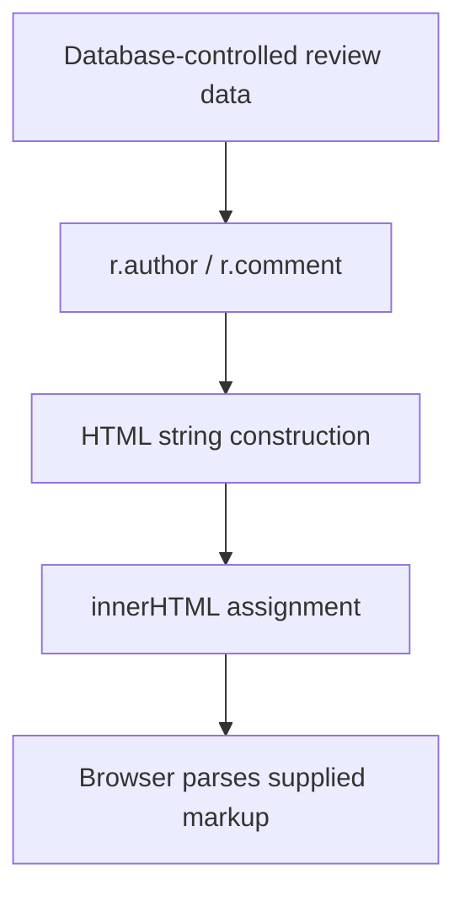
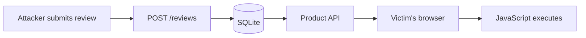
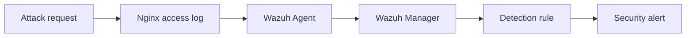

# OxCart Web Application Vulnerability Assessment

**Phase 5: Attack Simulation | Report 01: Initial Findings**

| | |
|---|---|
| **Target** | OxCart e-commerce application (Flask / SQLite behind Nginx) |
| **Environment** | Self-owned AWS lab, `ap-southeast-1` (see [architecture](../README.md)) |
| **Assessment type** | Authorized, grey-box web application assessment with source access |
| **Assessor** | _Your Name_ |
| **Report date** | 2026-10-05 |
| **Findings** | 2 (1 confirmed vulnerability, 1 confirmed attack surface) |
| **Status** | Findings open, remediation pending |

> **Authorization:** All testing was performed against infrastructure owned and operated by the assessor, in an isolated lab built for this purpose. No third-party systems or data were involved.

---

## Table of Contents

1. [Executive Summary](#1-executive-summary)
2. [Scope and Methodology](#2-scope-and-methodology)
3. [Finding OXC-001: SQL Injection Attack Surface in Product Lookup](#3-finding-oxc-001-sql-injection-attack-surface-in-product-lookup)
4. [Finding OXC-002: Stored Cross-Site Scripting in Product Reviews](#4-finding-oxc-002-stored-cross-site-scripting-in-product-reviews)
5. [Detection Engineering Results](#5-detection-engineering-results)
6. [Remediation Plan and Retest Criteria](#6-remediation-plan-and-retest-criteria)
7. [Limitations of This Assessment](#7-limitations-of-this-assessment)
8. [Appendix: Payload Reference](#8-appendix-payload-reference)

---

## 1. Executive Summary

This report documents the first round of attack-simulation testing against OxCart, a deliberately built web application used as the workload for a cloud security monitoring lab. The goals were to find exploitable weaknesses in the application and, equally, to measure whether the Wazuh SIEM deployed in the lab could detect the resulting attacks.

Two issues were identified.

| ID | Title | Severity | Confirmed | CWE | Status |
|---|---|---|---|---|---|
| **OXC-001** | SQL injection attack surface in `GET /product?id=` | **Not rated** (exploitation not confirmed) | Payloads reach the endpoint; data extraction not demonstrated | [CWE-89](https://cwe.mitre.org/data/definitions/89.html) | Open |
| **OXC-002** | Stored XSS in product reviews (`author`, `comment`) | **Medium** (CVSS 3.1 est. 6.1) | Yes, JavaScript execution demonstrated | [CWE-79](https://cwe.mitre.org/data/definitions/79.html) | Open |

### Key Takeaways

- **OXC-002 is a confirmed vulnerability.** Attacker-controlled review content is stored in the database, returned by the API, and inserted into the page with `innerHTML` without encoding. A malicious review executes JavaScript in the browser of any user who views it.
- **OXC-001 is an identified attack surface, not a confirmed exploit.** SQL injection payloads reached the application, but testing did not demonstrate data extraction or modification. The finding is recorded so that the endpoint is hardened and retested, and it is deliberately not given a severity score it has not earned.
- **Detection needed tuning.** Out of the box, Wazuh flagged the SQL injection attempts only as generic HTTP errors. Two custom rules were written and validated against live traffic. These signatures improve coverage but are not a substitute for fixing the underlying code.

---

## 2. Scope and Methodology

### 2.1 Scope

| In scope | Out of scope |
|---|---|
| OxCart Flask application endpoints, including `/product`, `/products`, and `POST /reviews` | AWS control plane and IAM |
| OxCart frontend JavaScript | Denial-of-service testing |
| Application data stored in SQLite | Bastion / SSH hardening |
| Wazuh detection of the above activity | Social engineering |

### 2.2 Test Setup

Attacks were launched from a Windows workstation against the Bastion's public address, so traffic followed the same path as a real external client:



### 2.3 Approach

Testing was iterative and moved from black-box probing to source-level analysis:



Techniques used: endpoint enumeration and functional testing, source-code review, controlled input manipulation, direct database inspection, HTTP testing with `curl`, Nginx access-log analysis, and Wazuh event monitoring. Both findings were demonstrated through the application's legitimate functionality, without altering the database directly or bypassing the normal request path.

### 2.4 Severity Rating

Confirmed vulnerabilities are rated using CVSS 3.1 base metrics as an estimate. Issues where exploitation has not been demonstrated are left unrated rather than assigned a speculative score.

---

## 3. Finding OXC-001: SQL Injection Attack Surface in Product Lookup

| | |
|---|---|
| **Component** | `GET /product?id=<product_id>` |
| **Weakness** | CWE-89: Improper Neutralization of Special Elements in an SQL Command |
| **Severity** | Not rated (exploitation not confirmed) |
| **Status** | Open |

### 3.1 Description

The product detail endpoint accepts an `id` parameter that directly selects which database record is returned. Because the parameter influences a database lookup, it was treated as a candidate injection point. SQL metacharacters and operators placed in this parameter were accepted by the web tier and delivered to the application.

### 3.2 Reconnaissance

A baseline request confirmed normal behaviour:

```powershell
curl.exe "http://<BASTION_PUBLIC_IP>/product?id=1"
```

The `id` parameter was accepted and used to retrieve a product.

### 3.3 Testing and Observations

The first payload was a classic boolean-based pattern, `1' OR '1'='1`, URL-encoded:

```powershell
curl.exe "http://<BASTION_PUBLIC_IP>/product?id=1%27%20OR%20%271%27%3D%271"
```

The application did not return a product, and Nginx logged an **HTTP 404**. No database manipulation or extraction was demonstrated. The request was still valuable: the full malicious URL reached the web server and was recorded in the access log, which made it possible to test the detection pipeline (Section 5).

Further payloads were then sent to check whether detection was limited to one exact string:

| Payload | Technique | Observed alert |
|---|---|---|
| `1' OR '1'='1` | Boolean-based | Generic web error (`31101`), then custom rule `100100` after tuning |
| `1' AND '1'='1` | Boolean-based | Custom SQL injection detection |
| `1' UNION SELECT 1,2,3--` | UNION-based | Built-in SQL injection rule `31103` |
| `1' OR 1=1--` | Boolean with comment | Generic web error (`31101`) only, then custom rule `100101` after tuning |

### 3.4 Assessment

Injection payloads are reaching the product endpoint, and the application's error handling returns 404 for malformed IDs. That behaviour is consistent with the input failing a lookup, but it does not prove the parameter is safely handled. Whether the query is built through string concatenation or parameterized access has not been established by black-box testing alone.

### 3.5 Impact

If the parameter is concatenated into SQL, an attacker could read other tables, modify records, or bypass lookup logic. Because exploitation was not demonstrated, this impact is **potential, not confirmed**.

### 3.6 Recommendations

1. **Use parameterized queries or the ORM for all lookups.** Never build SQL by concatenating request values.
2. **Validate type at the boundary.** The product ID is an integer; reject anything else before it reaches the database layer.
3. **Run the application's database account with least privilege** (read-only for the product catalogue where possible).
4. **Complete a source review** of the `/product` handler to confirm how the query is constructed and close out or upgrade this finding.

```python
# Illustrative: strict type validation, then a parameterized query
product_id = request.args.get("id", type=int)
if product_id is None:
    abort(400)

row = db.execute(
    "SELECT * FROM product WHERE id = ?", (product_id,)
).fetchone()
```

---

## 4. Finding OXC-002: Stored Cross-Site Scripting in Product Reviews

| | |
|---|---|
| **Component** | `POST /reviews`, review rendering in `renderReviews()` |
| **Affected fields** | `review.author`, `review.comment` |
| **Weakness** | CWE-79: Improper Neutralization of Input During Web Page Generation |
| **Severity** | **Medium**: CVSS 3.1 estimate **6.1** (`AV:N/AC:L/PR:N/UI:R/S:C/C:L/I:L/A:N`) |
| **Status** | Open |

> The CVSS vector assumes reviews can be submitted without authentication. If review posting requires a logged-in account, `PR` changes to `L` and the score drops accordingly.

### 4.1 Discovery

This issue was found while building the review feature. Reviews were originally kept only in client-side state. Because reviews are persistent data, they were moved into the SQLite database, with a new `Review` model (`id`, `product_id`, `author`, `rating`, `comment`, `date`) and a new `POST /reviews` endpoint accepting JSON.

That change created a realistic server-side data flow, which made persistent XSS testable:



### 4.2 Persistence Check

A test review was submitted and then read back directly from the database:

```bash
sqlite3 /opt/oxcart/oxcart.db \
  "SELECT id, author, comment FROM review ORDER BY id DESC LIMIT 3;"
```

```text
4|XSS_Test_01|<script>alert('OxCart XSS')</script>
```

HTML and JavaScript supplied through the review field were stored as-is, with no stripping or encoding.

### 4.3 Root Cause: Unsafe Rendering Sink

The frontend builds review markup by interpolating untrusted values into an HTML string and assigning it to `innerHTML`:

```javascript
feedHtml += `
  <article class="review-card">
    ...
    <h4>${r.author}</h4>
    ...
    <p>${r.comment}</p>
  </article>
`;

feedContainer.innerHTML = feedHtml;
```

No output encoding, sanitisation, or safe DOM insertion is applied to `author` or `comment` before they reach the sink.



### 4.4 Exploitation

**Attempt 1: `<script>` payload.** The payload below was submitted through the legitimate review form:

```html
<script>alert('OxCart XSS')</script>
```

The review rendered as blank space and no alert fired. This was initially ambiguous, but the payload had been stored (Section 4.2), so the failure to execute was investigated rather than written off. The explanation is that browsers do not execute `<script>` elements inserted via `innerHTML`. The tag is parsed into the DOM but never run.

**Attempt 2: event-handler payload.** An element that executes through an event handler is not subject to that restriction:

```html

```

Submitted through the same review form, this triggered an alert displaying `OxCart XSS`, confirming that attacker-controlled review content is interpreted as executable HTML and JavaScript.

### 4.5 Why This Is Stored XSS

The payload is not reflected from a single request. It follows a persistent path and executes whenever the data is rendered:



Database evidence of persistence (Section 4.2) plus the successful `onerror` execution together establish the vulnerability as stored rather than reflected.

### 4.6 Impact

A malicious reviewer can cause JavaScript to run in the browser of any user viewing the affected product. Script running in the application's origin can act with the victim's privileges in the page, which could include:

- Performing actions on the victim's behalf within the application
- Reading data visible to the page, depending on the authentication model
- Defacing page content or redirecting the user
- Reaching session material if cookies are not protected with `HttpOnly`

The proof of concept used a harmless `alert()` solely to demonstrate code execution. **No session tokens, credentials, personal data, or other sensitive information were accessed or exfiltrated during testing.**

### 4.7 Recommendations

1. **Render untrusted data safely (primary fix).** Use `textContent` or DOM construction instead of building HTML strings for `innerHTML`.
2. **If rich text is required,** sanitise with a maintained library such as DOMPurify rather than hand-written filters.
3. **Validate and constrain input server-side:** length limits, type checks on `rating`, and rejection or encoding of markup in `author`.
4. **Add a Content Security Policy** as defence in depth. A policy without `'unsafe-inline'` would also have blocked this `onerror` handler.
5. **Set `HttpOnly`, `Secure`, and `SameSite` on any session cookies** to limit what injected script can reach.

```javascript
// Illustrative: build the review with safe DOM APIs instead of innerHTML
const card = document.createElement("article");
card.className = "review-card";

const name = document.createElement("h4");
name.textContent = r.author;       // treated as text, never as markup

const body = document.createElement("p");
body.textContent = r.comment;

card.append(name, body);
feedContainer.appendChild(card);
```

```nginx
# Illustrative CSP; test against the frontend before enforcing
add_header Content-Security-Policy "default-src 'self'; script-src 'self'; object-src 'none'; base-uri 'self'" always;
```

---

## 5. Detection Engineering Results

A parallel objective of the assessment was to determine whether the SIEM could see these attacks. SQL injection attempts travelled through the pipeline below and became alerts:



### 5.1 Baseline Behaviour

The first payload was logged by Nginx as:

```text
GET /product?id=1%27%20OR%20%271%3D%271
```

Wazuh's existing generic web-server error rule (`31101`) fired on the resulting HTTP error. This showed that the telemetry pipeline works, but the alert did not identify the request as SQL injection.

### 5.2 Custom Rules

Two custom rules were written as children of `31101`:

```xml
<rule id="100100" level="10">
    <if_sid>31101</if_sid>
    <url>%27%20OR%20%27</url>
    <description>OxCart possible SQL injection attempt detected</description>
    <group>web,sql_injection,attack,</group>
</rule>

<rule id="100101" level="10">
    <if_sid>31101</if_sid>
    <url>%27%20OR%201%3D1--</url>
    <description>OxCart possible SQL injection OR 1=1 comment detected</description>
    <group>web,sql_injection,attack,</group>
</rule>
```

Each rule followed the same validation workflow:

1. Reproduce the attack and capture the raw Nginx log line.
2. Draft the rule and test it offline with `sudo /var/ossec/bin/wazuh-logtest`.
3. Restart the Wazuh manager.
4. Replay the attack against the live application and confirm the custom alert fires.

Rule `100101` exists because `1' OR 1=1--` initially produced only the generic `31101` alert, which exposed a coverage gap in the first rule.

### 5.3 Coverage Summary

| Payload | Before tuning | After tuning |
|---|---|---|
| `1' OR '1'='1` | `31101` (generic error) | `100100` |
| `1' AND '1'='1` | n/a | Custom SQLi detection |
| `1' UNION SELECT 1,2,3--` | `31103` (built-in SQLi) | `31103` |
| `1' OR 1=1--` | `31101` (generic error) | `100101` |

### 5.4 Detection Limitations

- **Signature matching is brittle.** The custom rules match specific URL-encoded strings. Case changes, whitespace variants (`/**/`, `+`), double encoding, or different operators can evade them. Rules should be generalised toward patterns, not individual payloads.
- **Rules depend on a `31101` parent.** They only fire when the request also produces an HTTP error. A payload that returns `200 OK` would not trigger them.
- **No visibility into POST bodies.** Per the lab's current telemetry (Nginx access log plus Flask logging of method, path, query, status, and duration), the contents of `POST /reviews` are not recorded. A stored-XSS submission would appear as an ordinary `POST /reviews 200`, so OXC-002 is effectively **undetected** by the current pipeline.
- **Attribution gap.** Flask currently logs the Bastion (`10.0.2.242`) as `src_ip` because the original client address is not yet extracted from `X-Forwarded-For`. Alerts therefore cannot yet identify the attacking host. This is a known limitation in the [architecture documentation](../README.md#11-known-limitations) and should be fixed before further attack simulation.

---

## 6. Remediation Plan and Retest Criteria

| ID | Action | Priority | Status |
|---|---|---|---|
| OXC-002 | Replace `innerHTML` string building with `textContent` / DOM APIs | High | Pending |
| OXC-002 | Add server-side validation and length limits on review fields | High | Pending |
| OXC-002 | Deploy a Content Security Policy | Medium | Pending |
| OXC-001 | Review `/product` handler; convert to parameterized query and integer validation | High | Pending |
| OXC-001 | Apply least-privilege database account | Medium | Pending |
| Detection | Log request bodies (or validation failures) for `POST /reviews` | Medium | Pending |
| Detection | Generalise SQLi rules; decouple from the `31101` error parent | Medium | Pending |
| Telemetry | Extract the real client IP from `X-Forwarded-For` | High | Pending |

### Retest Checklist

After remediation, replay the original proof-of-concept payloads and record the results:

- [ ] `<script>alert('OxCart XSS')</script>` is stored and displayed as inert text
- [ ] `` is displayed as inert text and no alert fires
- [ ] `id=1' OR '1'='1` returns a clean `400` / `404` and is never interpreted as SQL
- [ ] `id=1' UNION SELECT 1,2,3--` returns a clean error with no data leakage
- [ ] SQL injection variants still generate alerts with the correct client IP
- [ ] Existing legitimate functionality (browsing products, posting a review) still works

---

## 7. Limitations of This Assessment

- Testing covered two issues in a small application and is **not** a comprehensive security assessment.
- OXC-001 was assessed primarily from the detection side. Exploitability has not been confirmed or ruled out.
- The XSS impact analysis is theoretical beyond the demonstrated `alert()`. No session theft or data exfiltration was attempted.
- The CVSS score for OXC-002 is an estimate and depends on the application's authentication model.
- All testing was performed in a controlled lab with synthetic data. Findings should not be generalised to production systems.

---

## 8. Appendix: Payload Reference

### SQL injection payloads (OXC-001)

| Raw payload | URL-encoded form used |
|---|---|
| `1' OR '1'='1` | `1%27%20OR%20%271%27%3D%271` |
| `1' AND '1'='1` | `1%27%20AND%20%271%27%3D%271` |
| `1' UNION SELECT 1,2,3--` | `1%27%20UNION%20SELECT%201%2C2%2C3--` |
| `1' OR 1=1--` | `1%27%20OR%201%3D1--` |

Example request:

```powershell
curl.exe "http://<BASTION_PUBLIC_IP>/product?id=1%27%20OR%201%3D1--"
```

### XSS payloads (OXC-002)

| Payload | Result |
|---|---|
| `<script>alert('OxCart XSS')</script>` | Stored; did **not** execute (scripts inserted via `innerHTML` do not run) |
| `` | Stored; **executed** |

### Tooling

`curl` (Windows PowerShell), `sqlite3`, Wazuh Dashboard (Threat Hunting / Events), `wazuh-logtest`, Nginx access log.

---

*This report documents testing performed on a personal cybersecurity lab for educational and portfolio purposes.*
